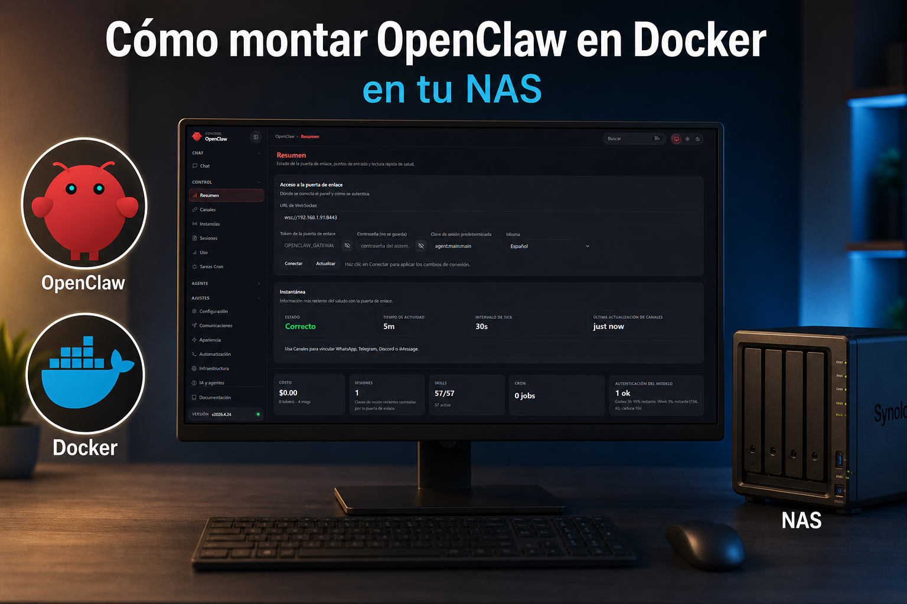

# OpenClaw on NAS

<p align="center">
  
  
  
  
  
  
</p>

<p align="center">
  
</p>

Docker deployment for OpenClaw on a NAS with local HTTPS.
Access is **LAN-only** — do not port-forward OpenClaw from your router.

```text
LAN browser -> https://<nas-ip>:8443 -> Nginx TLS proxy -> OpenClaw gateway
```

The NAS deployment uses the pre-built image published by this repository:

```text
ghcr.io/luprintech/openclaw_nas_docker:<OPENCLAW_VERSION>
```

The NAS does **not** build the image locally. GitHub Actions builds the image from
`Dockerfile` and publishes it to GHCR; `docker-compose.yml` only pulls and runs it.

Tested on Synology. Should work on any NAS that runs Docker
(QNAP, Ugreen, TerraMaster, Asustor, etc.).

---

## First install, step by step

This guide assumes you are installing OpenClaw on a NAS inside your LAN.
The examples use `192.168.1.50` as the NAS IP. Replace it with your real NAS IP.

> **Security rule:** keep OpenClaw LAN-only. Do **not** port-forward `18789` or `8443` from your router.

### 0. Give your NAS a stable LAN IP

OpenClaw stores your NAS IP in `.env` and uses it for dashboard URLs, allowed browser origins, and local HTTPS certificates.
If your NAS IP changes later, the dashboard URL, certificate, and `OPENCLAW_CONTROL_UI_ALLOWED_ORIGINS` can stop matching.

Use one of these approaches:

| Option | Recommended? | Tradeoff |
| ------ | ------------ | -------- |
| DHCP reservation in your router | **Best option** | The router always gives the same IP to the NAS. Low risk, easy rollback. |
| Static IP in the NAS control panel | Good option | Works without router changes, but a wrong gateway/DNS/subnet can disconnect the NAS. |
| Static IP by SSH | Not recommended for Synology | Possible only with low-level Linux/network commands and may not survive DSM network management or reboot. Easy way to lock yourself out. |

#### Recommended: reserve the IP in your router

In your router/admin panel:

1. Find the NAS in the DHCP / LAN clients list.
2. Copy its MAC address.
3. Create a DHCP reservation, also called static lease or address reservation.
4. Assign an IP outside or safely within your DHCP plan, for example:

```text
192.168.1.50
```

5. Reboot the NAS or renew its network lease.
6. Confirm the NAS still answers on that IP.

This is the cleanest architecture: the router owns addressing, the NAS just receives the same address every time.

#### Synology DSM: set a manual IP from the UI

If you prefer setting the IP directly in Synology DSM:

1. Open DSM in your browser.
2. Go to **Control Panel**.
3. Open **Network**.
4. Go to **Network Interface**.
5. Select your active LAN interface, usually **LAN 1**.
6. Click **Edit**.
7. In IPv4 settings, choose manual configuration instead of DHCP.
8. Set:
   - **IP address**: for example `192.168.1.50`
   - **Subnet mask**: commonly `255.255.255.0`
   - **Gateway**: your router IP, for example `192.168.1.1`
   - **DNS server**: your router IP or a DNS server you trust
9. Apply the changes.
10. Reconnect to DSM using the new IP.

Be careful here. If you put the wrong gateway, subnet, or IP range, you can lose access to DSM until you fix networking locally.

#### Can I assign the static IP by SSH?

For this project, do **not** document SSH as the normal way to set a permanent Synology IP.
DSM owns network configuration and can overwrite low-level changes. Commands like `ip addr` are useful for diagnostics or temporary changes, not as a reliable persistent setup path.

Use SSH only to check the current address:

```bash
hostname -I
ip addr
```

Now continue with that stable IP in the rest of the guide.

### 1. Know your NAS LAN IP

Find the LAN IP of your NAS from your router, NAS control panel, or SSH:

```bash
hostname -I
```

Example used below:

```text
192.168.1.50
```

### 2. Copy the repo to the NAS

Choose a path that makes sense for your NAS:

| NAS      | Typical path                              |
| -------- | ----------------------------------------- |
| Synology | `/volume1/docker/openclaw`                |
| QNAP     | `/share/Container/openclaw`               |
| Others   | `/opt/openclaw` or any writable directory |

Then connect by SSH:

```bash
ssh <user>@<nas-ip>
cd /path/to/openclaw
```

Example:

```bash
ssh admin@192.168.1.50
cd /volume1/docker/openclaw
```

### 3. Create your `.env` file

Copy the example file:

```bash
cp .env.example .env
```

Now edit it with your preferred editor:

```bash
nano .env
```

If your NAS does not have `nano`, use `vi` or edit the file from the NAS file manager.

### 4. Create `OPENCLAW_GATEWAY_TOKEN`

`OPENCLAW_GATEWAY_TOKEN` is the shared secret used by the OpenClaw gateway and the web dashboard.
Anyone who can reach your NAS and knows this token can access the gateway, so make it long and random.

Generate one with **one** of these commands.

Linux / macOS / most NAS systems:

```bash
openssl rand -hex 32
```

Python fallback:

```bash
python3 - <<'PY'
import secrets
print(secrets.token_hex(32))
PY
```

Windows PowerShell, if you prepare the file from your PC:

```powershell
[guid]::NewGuid().ToString() + [guid]::NewGuid().ToString()
```

Put the generated value in `.env`:

```env
OPENCLAW_GATEWAY_TOKEN=paste-your-generated-token-here
```

Rules for the token:

- Minimum 32 characters.
- Use letters, numbers, and hyphens only.
- Do **not** wrap it in quotes.
- Do **not** commit `.env` to Git.

> The installer can generate `OPENCLAW_GATEWAY_TOKEN` automatically if it is empty. Still, creating it yourself first is better because you understand what security boundary you are setting. CONCEPTS before automation.

### 5. Complete the required `.env` values

At minimum, configure the NAS IP, bind addresses, timezone, and optionally one AI provider key.

#### Required mode for browser access: local HTTPS with bundled Nginx

Use HTTPS for browser access. This is the supported path for this guide:

```env
NAS_IP=192.168.1.50
OPENCLAW_HTTPS_MODE=local
OPENCLAW_HOST_BIND=127.0.0.1
OPENCLAW_PROXY_BIND=192.168.1.50
OPENCLAW_HTTPS_PORT=8443
OPENCLAW_CONTROL_UI_ALLOWED_ORIGINS=["https://192.168.1.50:8443"]
TZ=Europe/Madrid
```

What this means:

- `NAS_IP`: the LAN IP of your NAS.
- `OPENCLAW_HTTPS_MODE=local`: enables the bundled Nginx TLS proxy.
- `OPENCLAW_HOST_BIND=127.0.0.1`: keeps the raw OpenClaw gateway private on the NAS.
- `OPENCLAW_PROXY_BIND`: publishes Nginx on your NAS LAN IP.
- `OPENCLAW_HTTPS_PORT=8443`: final browser URL will be `https://<nas-ip>:8443`.
- `OPENCLAW_CONTROL_UI_ALLOWED_ORIGINS`: tells OpenClaw which HTTPS browser origin is allowed to load the Control UI.

#### About `http://<nas-ip>:18789`

Do **not** use `http://192.168.1.50:18789` as the normal browser URL.
That port is the raw OpenClaw gateway port. In the HTTPS setup above it is bound to `127.0.0.1`, so it stays private on the NAS and Nginx is the only LAN-facing entry point.

Correct browser URL:

```text
https://192.168.1.50:8443
```

This matters because the dashboard uses browser security features that expect a secure origin. Treat HTTP as an internal implementation detail, not as the user-facing access method.

### 6. Configure at least one AI provider, or plan to do it during onboarding

OpenClaw needs an AI provider to be useful. Fill in one or more provider keys in `.env` if you already have them:

```env
GEMINI_API_KEY=
OPENROUTER_API_KEY=
ANTHROPIC_API_KEY=
OPENAI_API_KEY=
MISTRAL_API_KEY=
GROQ_API_KEY=
COHERE_API_KEY=
```

One key is enough to start. If you leave them empty, validation warns you, but onboarding can still configure providers later.

### 7. Make scripts executable

```bash
chmod +x install.sh openclaw scripts/*.sh
```

### 8. Run the installer

Run the installer in local HTTPS mode:

```bash
./install.sh 192.168.1.50
```

Do not use plain HTTP mode for normal browser access.

The installer will:

- Create `.env` from `.env.example` if missing.
- Generate `OPENCLAW_GATEWAY_TOKEN` if it is still empty.
- Store `NAS_IP` in `.env`.
- Configure local HTTPS mode.
- Generate local TLS certificates under `certs/`.
- Validate your environment.
- Pull and start the Docker Compose stack using the pre-built GHCR image.
- Apply the allowed Control UI origins automatically.

### 9. Install the local root certificate on each client device

Copy the generated root certificate from the NAS to every device that will open OpenClaw:

```text
certs/rootCA.pem
```

Windows users can use:

```text
certs/rootCA.cer
```

Then trust that certificate on the device. See [Installing rootCA.pem](#installing-rootcapem) below.

If you skip this step, the browser will warn that the HTTPS certificate is not trusted. That is expected: you created a private local CA for your LAN, not a public internet certificate.

### 10. Open the OpenClaw dashboard

Use the HTTPS URL:

```text
https://192.168.1.50:8443
```

Do not open the dashboard through plain HTTP.

When the dashboard asks for the gateway token, paste the exact value from `.env`:

```env
OPENCLAW_GATEWAY_TOKEN=your-token-here
```

Do not paste the key name. Paste only the token value.

### 11. Run onboarding

From the NAS project directory:

```bash
./openclaw onboard
```

This runs OpenClaw onboarding inside the Docker container without installing a host daemon.

### 12. Pair your browser

Pairing is the step that authorizes your browser as a known device.

Print the dashboard and pairing information:

```bash
./openclaw dashboard
```

Then:

1. Open the printed dashboard / pairing URL in your browser.
2. Enter `OPENCLAW_GATEWAY_TOKEN` if the UI asks for it.
3. Start the pairing flow from the browser.
4. Go back to SSH and list pending devices:

```bash
./openclaw devices
```

5. Copy the pending `request_id`.
6. Approve it:

```bash
./openclaw approve <request_id>
```

Example:

```bash
./openclaw approve abc123
```

7. Refresh the browser dashboard.

Your browser should now be paired and allowed to use the OpenClaw Control UI.

### 13. Verify the stack is running

```bash
./openclaw status
./openclaw doctor
```

If something fails, check logs:

```bash
./openclaw logs
./openclaw logs openclaw-gateway
./openclaw logs nginx
```

---

## Subsequent installs and updates

After the first install, the NAS IP and HTTPS mode are saved in `.env`.
You only need to run:

```bash
./install.sh
```

No arguments needed.

---

## Installing rootCA.pem

### Windows

1. Copy `certs/rootCA.cer` to the PC.
2. Double-click it → Install Certificate.
3. Choose **Local Machine**.
4. Place it in **Trusted Root Certification Authorities**.

### macOS

1. Open `rootCA.pem` → Keychain Access adds it to System keychain.
2. Open the certificate → set SSL trust to **Always Trust**.

### iPhone / iPad

1. Open `rootCA.pem` on the device → Install Profile.
2. Go to **Settings → General → About → Certificate Trust Settings**.
3. Enable full trust for the CA.

### Android

```text
Settings → Security → Encryption & credentials → Install a CA certificate
```

Exact names vary by manufacturer.

---

## Operational commands

```bash
./openclaw onboard               # First-time setup
./openclaw dashboard             # Print dashboard / pairing URL
./openclaw devices               # List devices
./openclaw approve <request_id>  # Approve a device
./openclaw doctor                # Run diagnostics
./openclaw claude                # Open Claude Code interactive TUI
./openclaw message send --target <channel> --message "hi"  # Send a message
./openclaw agent --message "hi"  # Talk to the assistant
./openclaw status                # Container status
./openclaw logs                  # Follow all logs
./openclaw logs openclaw-gateway # Gateway logs only
./openclaw logs nginx            # Nginx logs only
./openclaw restart               # Restart the stack
./openclaw stop                  # Stop the stack
```

Raw CLI pass-through:

```bash
./openclaw config get gateway.bind
```

---

## Updating OpenClaw

Check for new versions:

```bash
./openclaw update-version
```

Then deploy:

```bash
docker compose pull
./openclaw restart
```

---

## Troubleshooting

### EACCES: permission denied

OpenClaw runs as UID/GID `1000` inside the container. Most NAS systems create
bind-mount directories owned by the SSH user, which causes EACCES errors like:

```text
EACCES: permission denied, open '/home/node/.openclaw/openclaw.json...tmp'
```

Fix:

```bash
cd /path/to/openclaw
sudo chown -R 1000:1000 config workspace
sudo chmod -R u+rwX config workspace
./openclaw restart
```

If certificate generation fails with permission denied under `certs/`:

```bash
sudo chown -R "$(id -u):$(id -g)" certs
chmod -R u+rwX certs
```

If your NAS user cannot use `sudo`, fix ownership from your NAS admin panel
(DSM File Station on Synology, File Manager on QNAP, etc.).

### Container name conflicts

If you see:

```text
Conflict. The container name "/openclaw-gateway" is already in use
```

you have leftovers from an older install with fixed container names.

```bash
docker ps -a --filter name=openclaw
docker stop openclaw-gateway openclaw-cli openclaw-nginx 2>/dev/null || true
docker rm   openclaw-gateway openclaw-cli openclaw-nginx 2>/dev/null || true
./install.sh
```

### Missing bind mount directories

If Docker reports a missing bind mount, create the directories and rerun:

```bash
mkdir -p config workspace certs
./install.sh
```

Current versions of `install.sh` create these directories automatically.

---

## Security rules

- Do not port-forward `18789` or `8443` from the router.
- Keep `certs/` private — it is ignored by Git.
- Never commit `.env` — it contains `OPENCLAW_GATEWAY_TOKEN`.
- Install only OpenClaw skills/plugins you trust.
